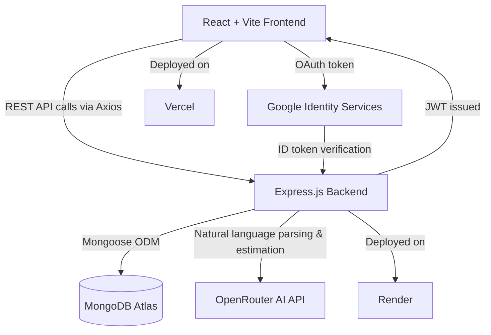
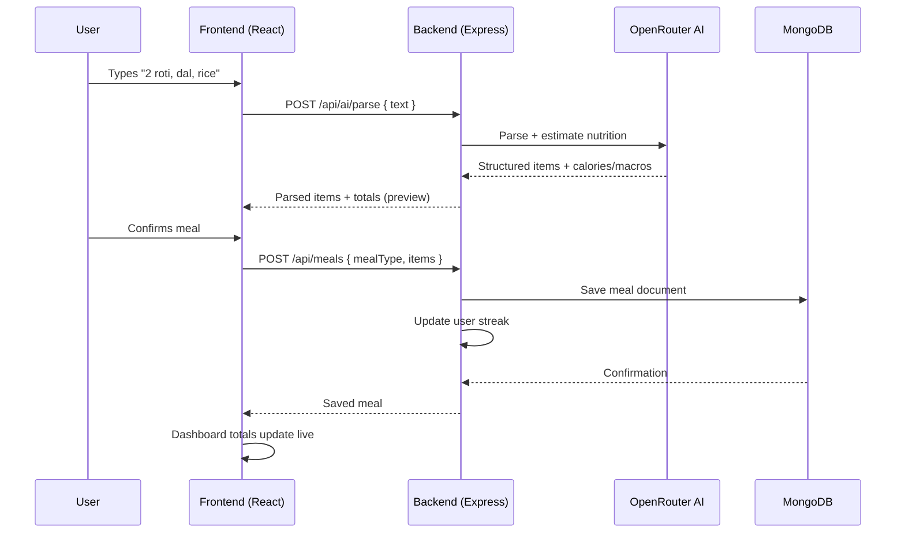

# 🥗 FoodLog — AI-Powered Nutrition & Meal Tracking Platform

FoodLog is a full-stack nutrition tracking application built for Indian users, letting them log meals in natural language — English, Hindi, or Hinglish — instead of manually searching a food database. AI handles understanding what you ate; deterministic logic and structured data handle the actual nutrition math, so the numbers stay trustworthy.

> "Log your food. Understand your nutrition."

🔗 **Live Demo:** https://food-log-rose.vercel.app/
*(Click "Get Started for Free" on the landing page to try the AI meal analysis instantly — no signup required.)*

---

## ✨ Features

- **Natural language meal logging** — type "2 aloo parathe aur chai" and get a full nutrition breakdown
- **AI-powered parsing & estimation** via OpenRouter — identifies food items, quantities, and estimates calories/macros
- **What-If Meal Simulator** — preview a meal's impact before committing, with conversational Hinglish guidance whose tone adapts to how close you are to your daily limit
- **Remaining nutrition budget** — live calorie/protein/carb/fat tracking against daily goals
- **Goal calculator** — BMR/TDEE-based target calculation (Mifflin-St Jeor formula) for users who don't know their macros
- **Progress & Insights** — daily/weekly/monthly trend charts, automatic pattern detection (low protein, weekend spikes, inconsistent logging)
- **AI Suggestions page** — categorized, personalized tips generated fresh from today's intake
- **Recipes** — vegetarian meal recommendations that fit your remaining daily budget
- **Google Sign-In** + traditional email/password auth (JWT + bcrypt)
- **Public demo mode** — full interactive experience with real AI, no signup required, nothing persisted
- **Fully responsive** — mobile drawer navigation, adaptive grids across every page

---

## 🏗️ Architecture



**Request flow for logging a meal:**



---

## 🧰 Tech Stack

**Frontend**
- React 18 + Vite
- Tailwind CSS
- React Router
- Axios
- Recharts (charts)
- Lucide React (icons)
- @react-oauth/google (Google Sign-In)

**Backend**
- Node.js + Express.js
- MongoDB + Mongoose
- JWT + bcryptjs (authentication)
- OpenRouter API (AI natural language parsing & nutrition estimation)
- google-auth-library (Google OAuth verification)
- express-rate-limit (public demo endpoint protection)

**Database**
- MongoDB Atlas (cloud)

**Deployment**
- Frontend → [Vercel](https://food-log-rose.vercel.app/)
- Backend → Render

---

## 📁 Project Structure

FoodLog/
├── backend/
│ ├── config/ # Database connection
│ ├── controllers/ # Route logic (auth, meals, AI, goals, insights, recipes)
│ ├── models/ # Mongoose schemas (User, Meal, FoodItem, Goal)
│ ├── routes/ # Express route definitions
│ ├── services/ # OpenRouter integration, nutrition calculation, insights
│ ├── middleware/ # Auth protection, error handling, rate limiting
│ ├── data/ # Seed food database (JSON)
│ ├── seed/ # DB seeding script
│ └── server.js
│
├── frontend/
│ ├── src/
│ │ ├── api/ # Axios instance with auth interceptor
│ │ ├── components/ # Reusable UI components, grouped by feature
│ │ ├── context/ # Auth & Demo state providers
│ │ ├── pages/ # Route-level page components
│ │ ├── utils/ # Local (offline) parsing utilities for demo mode
│ │ └── App.jsx
│ └── index.html


---

## 🚀 Getting Started

### Prerequisites
- Node.js 18+
- MongoDB Atlas account (or local MongoDB)
- OpenRouter API key ([openrouter.ai](https://openrouter.ai))
- Google Cloud OAuth Client ID (for Google Sign-In)

### 1. Clone the repository
```bash
git clone https://github.com/YOUR_USERNAME/foodlog.git
cd foodlog
```

### 2. Backend setup
```bash
cd backend
npm install
```

Create `backend/.env`:

PORT=5000
MONGO_URI=your_mongodb_atlas_connection_string
JWT_SECRET=your_random_secret_string
JWT_EXPIRES_IN=7d
OPENROUTER_API_KEY=your_openrouter_api_key
OPENROUTER_MODEL=openai/gpt-4o-mini
GOOGLE_CLIENT_ID=your_google_oauth_client_id


Seed the food database, then start the server:
```bash
npm run seed
npm run dev
```

### 3. Frontend setup
```bash
cd frontend
npm install
```

Create `frontend/.env`:

VITE_API_URL=http://localhost:5000/api
VITE_GOOGLE_CLIENT_ID=your_google_oauth_client_id


```bash
npm run dev
```

Visit `http://localhost:5173`.

---

## 🔌 Key API Endpoints

| Method | Endpoint | Description |
|--------|----------|-------------|
| POST | `/api/auth/signup` | Register a new user |
| POST | `/api/auth/login` | Login with email/password |
| POST | `/api/auth/google` | Login/signup via Google |
| POST | `/api/ai/parse` | Parse & estimate nutrition from natural language |
| POST | `/api/ai/whatif-advice` | Conversational Hinglish guidance for a hypothetical meal |
| GET | `/api/ai/suggestions` | Categorized AI suggestions based on today's intake |
| POST | `/api/meals` | Save a meal (or preview with `preview: true`) |
| GET | `/api/meals/today/summary` | Today's totals, goals, and remaining budget |
| POST | `/api/goals/calculate` | BMR/TDEE-based goal calculation |
| GET | `/api/insights` | 7/30-day pattern analysis |
| GET | `/api/recipes` | Budget-matched vegetarian recipe suggestions |

---

## 🧠 Design Decisions

- **AI never does deterministic math directly** — it parses language and estimates nutrition, but every number shown is calculated transparently and labeled (`ai-estimated`) rather than presented as lab-precise.
- **Demo mode is fully isolated** — public users get the real AI experience with zero persistence, rate-limited server-side to control cost.
- **Tone-adaptive AI guidance** — the What-If Simulator's advice tone (warm vs. firm vs. blunt) is determined deterministically by budget overage percentage, then passed to the AI as an explicit instruction, rather than left to the model's own judgment.

---

## 📄 License

This project was built as a final-year academic portfolio project.

## 👤 Author

**Anshuman Tiwari**
Final-year B.Tech CSE, ABES Institute of Technology, Ghaziabad
[GitHub](https://github.com/Anshu-1506/) · [LinkedIn](https://www.linkedin.com/in/anshuman-tiwari-41bb64368)